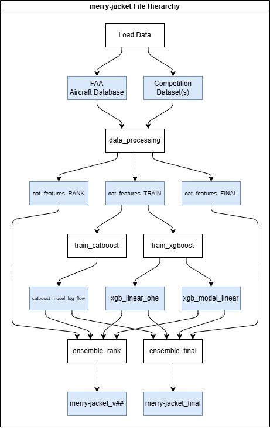

# PRC Data Challenge 2025 - merry_jacket
### Emre Demirci, Egeberk Baruh Karabulut
The objective of this challenge was to build a Machine Learning model predicting the fuel consumption of an aircraft using its available ADSB and ACARS data. As two Aerospace Engineering bachelor students from TU Delft, we approached this challenge as an opportunity to apply and develop our machine learning skills in a realistic aviation context. Despite limited time and prior experience, we worked to create the most effective model possible. As we finalize this project within the competition frame, we see it not as the end but the beginning of a project that will continue to grow as we learn and build upon it.

It must be noted that we did not create a fully original model to tackle the challenge. However, our original contributions in the competition are the choice of data and feature engineering, and the implementation of an ensemble learning model that aims to combine XGBoost and CatBoost to leverage their respective capabilities. The process is explained in the following section, *Method Overview*.
## Method Overview 
### Model Choice and First Steps
Fuel estimation in this challenge relies on categorical and numerical aircraft data that are highly irregular, partially missing and strongly nonlinear. Given the nature of the data, we deemed Gradient-Boosted Regression Tree to be the most suitable model for this particular application, which naturally captures complex nonlinear relationships and handles categorical and missing data without extensive preprocessing. These properties made it a more robust and reliable choice than common alternatives such as Neural Networks for this type of structured aviation data. This decision also came with certain caveats when it comes to input data, especially constraining our ability to fully exploit available time-series data. This necessitated a strong selection of features to effectively summarize each interval for the model to interpret the fuel consumption in the absence of chronological information. We believe that this choice reduced the overall computational demand considering the resources available. 

Our final ensemble consisted of CatBoost with its symmetrical trees to prevent overfitting, and XGBoost to complement it with its affinity with finding deep relationships. The intention, after exploratory analysis, was to cover each model's weaknesses and bias with the other one through an ensemble. Notable improvements here would be to also consider different architectures altogether to support this ensemble.

### Data Preparation and Feature Engineering
We first focused on transforming the raw data into a feature matrix by processing flight data in parallel. For each fuel consumption interval, Kinematic Aggregation was performed, calculating summary statistics like Mean Altitude and Max Vertical Rate from the time-series trajectory data. This was augmented with Static Context (e.g., MTOW, wingspan) and Derived Proxies (e.g., Mass Ratio Proxy) to capture aerodynamic and operational characteristics. Critical to this process was the handling of data irregularity. Intervals with missing trajectory data were flagged using an is_missing_data feature, and all corresponding kinematic values were set to 0.0. This strategy attempted to avoid imputation bias and allow the GBRT models to treat the zero state as a distinct, low-activity operational mode. Finally, all categorical features were converted to strings and missing values were encoded as "MISSING" for CatBoost. XGBoost on the other hand had to resort to One-Hot Encoding due to lack of built-in category handling.

| Feature | Description |
|----------|----------|
| idx   |Unique submission row identifier for merging. |
| flight_id   |Unique identifier for the flight entity.|
|fuel_kg | Target variable. Raw fuel burnt in kg.|
|aircraft_type| ICAO code of the aircraft type (e.g., 'B744') |
|gear_config|Main gear configuration string (e.g., '2D/2D2').|
|icao_wtc|Wake Turbulence Category (e.g., 'Heavy', 'Medium'). |
|route_distance_nm|Great Circle distance between Origin and Destination.|
|elev_diff_ft|Elevation delta: Destination Elev - Origin Elev.|
|hour_sin|Cyclical transformation (sin) of takeoff hour. |
|hour_cos|Cyclical transformation (cos) of takeoff hour.|
|MTOW_kg|Maximum Takeoff Weight.|
|MALW_kg|Maximum Landing Weight.|
|wingspan_m|Physical span of wings.|
|length_m|Fuselage length.|
|tail_height_m|Vertical stabilizer height.|
|wheelbase_m|Distance between nose and main gear.|
|approach_speed_ms|Vref. Proxy for low-speed aerodynamics.|
|duration|Segment duration in seconds.|
|avg_altitude|Mean altitude.|
|avg_groundspeed|Mean ground speed.|
|avg_TAS|True Airspeed.|
|avg_mach|Mach number calculated with ISA.|
|avg_vert_rate|Vertical speed (ft/min).|
|max_abs_vert_rate|Maximum absolute vertical rate.|
|delta_altitude|Max Altitude - Min Altitude in segment.|
|time_into_flight_ratio|(Start - Takeoff) / Total Duration.|
|mass_ratio_proxy|MTOW * (1 - time_into_flight_ratio). Estimated weight left.|
|aspect_ratio_proxy|Wingspan / Length.|
|tail_length_ratio|Tail Height / Length.|
|weight_delta_ratio|(MTOW - MALW) / MTOW.|
|energy_rate_index|Mass Proxy * Vertical Rate. Power demand.|
|mass_speed_index|Mass Proxy * TAS. Momentum.|
|distance_nm_approx|Avg Speed * Duration.|
|is_missing_data|Explicit Flag (1=Blind, 0=Valid).|

### Model Training
The CatBoost Regressor was trained to specialize in predicting the logarithm of the fuel flow rate, a strategy aimed at stabilizing the target variance and mitigating the influence of extreme values.
Conversely, the XGBoost Regressor was trained on the complementary task of predicting the raw fuel consumption. This dual-model approach, utilizing different target variables and categorical handling methods, provided diverse predictive inputs for the final ensemble, improving robustness. Hyperparameters were tuned via Optuna and validated using Group K-Fold. This grouping ensures that models are validated on entirely unseen flights, not just unseen segments of the same trained flights - a pitfall which we found ourselves in when training and ranking performance showed high discrepancy.

### Submission Creation and Ensemble Blending
The final step was the creation of the submission files. For both Ranking and Final submission phases, predictions were generated: CatBoost predicted the log-flow rate which was then exponentiated and multiplied by duration to get fuel, and XGBoost predicted the fuel directly. The core operation was the blending of these two predictions using the optimized weights of 0.70 (CatBoost) and 0.30 (XGBoost), which had been determined through hand tuning to maximize ensemble performance. The resulting blended prediction arrays for the Ranking and Final phases were then concatenated before saving the required .parquet files. These files were then sent for ranking through Minio.

## References
1 - Prokhorenkova, L., Gusev, G., Vorobev, A., Dorogush, A. V., and Gulin, A., “CatBoost: Unbiased Boosting with Categorical Features,” arXiv:1706.09516, 2017. Available at: https://arxiv.org/abs/1706.09516.

2 - Ke, G., Meng, Q., Finley, T., Wang, T., Chen, W., Ma, W., Ye, Q., and Liu, T.-Y., “LightGBM: A Highly Efficient Gradient Boosting Decision Tree,” arXiv:1603.02754, 2017. Available at: https://arxiv.org/abs/1603.02754.

3 - Federal Aviation Administration, “Aircraft Characteristics Database,” Federal Aviation Administration, 2024. Available at: https://www.faa.gov/airports/engineering/aircraft_char_database.
